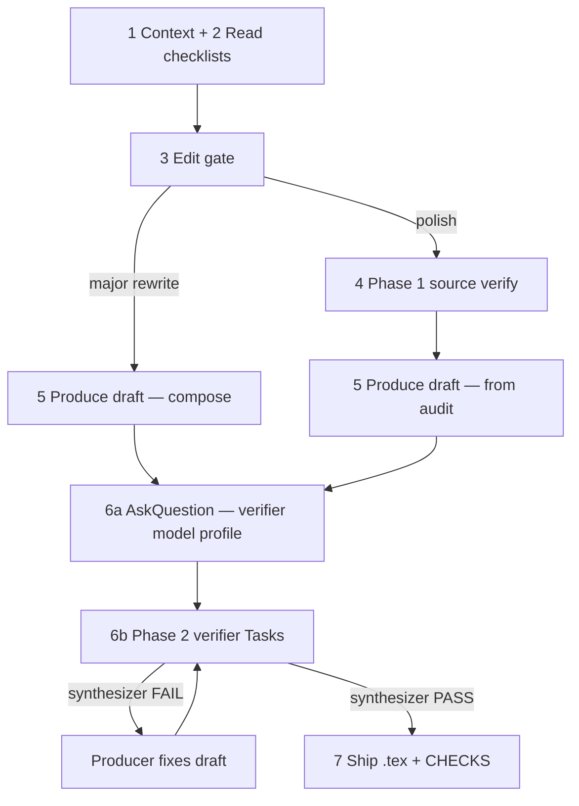

# Physics Paper Editing (micro)

Expert scientific editor for physics and mathematics at graduate level.

## Agent read order

| Situation | Read |
|-----------|------|
| **Standalone micro job (≤12 sentences)** | This file → step 2 table → detail files per step |
| **Scope overflow (>12 sentences)** | § Scope overflow below — route to macro skill; do **not** read [cross-skill.md](cross-skill.md) |
| **Invoked from macro Stage D** | This file + [Invoked by section macro](#invoked-by-section-macro-optional) + [cross-skill.md](cross-skill.md) § Verifier model profile |

**Use this skill alone** when the user gives a passage of **≤12 sentences** — run steps 1–7 below. No macro skill, no `cross-skill.md`, no `.physics-edit/` on that path.

**Scope overflow (>12 sentences or whole section):** stop the micro pipeline; suggest [physics-paper-editing-section](../physics-paper-editing-section/SKILL.md) or ask the user to narrow the quote. Detail: [Scope overflow](#scope-overflow).

## Invoked by section macro (optional)

Read this section **only** when Stage D passes `chunk_text` + `edit_gate` + `session.md` via [chunk-contract.md](../physics-paper-editing-section/chunk-contract.md). Otherwise ignore.

- Run the same steps 1–7 on `chunk_text` only.
- **Skip micro edit gate Q2** — use supplied `edit_gate` (`polish` \| `rewrite`).
- **Verifier models:** inherit from `session.md` when `user_confirmed: true`; else AskQuestion. Handoff rules: [cross-skill.md](cross-skill.md) § Verifier model profile.
- Set `caller: section-orchestrator` in the Task plan ([compliance-monitoring.md](compliance-monitoring.md)).

## Purpose

Edit LaTeX prose using a **two-phase verification pipeline**:

1. **Phase 1 (source verify)** — audit the user's existing prose before editing (polish path only).
2. **Phase 2 (output verify)** — independent verifier subagents grade the producer's draft before shipping.

The **producer** (main agent) writes the draft and applies fixes. It **must not** grade its own draft or set `OVERALL: PASS|FAIL` — only the Phase 2 **verifier synthesizer** may do that.

---

## Unit of work

| | |
|--|--|
| **Scope** | One passage, **≤12 sentences** |
| **Input** | Passage + optional context (neighbors, section title, brief) |
| **Output (Agent)** | Synthesizer `OVERALL: PASS`, `.tex` updated, verbatim `<!-- CHECKS ... -->` |
| **Output (Ask)** | CHECKS block + preview; no `.tex` write until Agent mode |

Passages **>12 sentences** are out of scope — see [Scope overflow](#scope-overflow).

**Verifier models (standalone):** `AskQuestion` per [phase2-verify-subagents.md](phase2-verify-subagents.md) § Model selection gate (same-chat reuse is the only skip).

---

## Standalone quick start

Default path when only this skill is attached and the quote is **≤12 sentences**:

1. **Scope** — confirm ≤12 sentences ([Scope overflow](#scope-overflow) if not).
2. **Read** — step 2 table below (+ detail files for steps 3–7).
3. **Edit gate** — polish vs major rewrite ([gate.md](gate.md)).
4. **Phase 1** — if polish; skip if major rewrite.
5. **Produce draft** — step 5.
6. **Phase 2** — `AskQuestion` (*Verifier model profile*) on first iteration unless same-chat reuse ([phase2-verify-subagents.md](phase2-verify-subagents.md) § Model selection gate).
7. **Ship** — `.tex` + synthesizer CHECKS only after `OVERALL: PASS`.

---

## Scope overflow

When the target has **>12 sentences** or the user asks for a whole `\section{...}`:

1. Do **not** run steps 3–7 on the full text in one turn.
2. Tell the user the passage exceeds micro scope.
3. Offer: attach [physics-paper-editing-section](../physics-paper-editing-section/SKILL.md), **or** narrow to ≤12 sentences.

That is the **only** macro awareness required on a standalone micro job. Do not read [cross-skill.md](cross-skill.md) unless you are routing overflow or were invoked from macro Stage D ([Invoked by section macro](#invoked-by-section-macro-optional)).

---

## Roles and terms

| Term | Meaning |
|------|---------|
| **Producer** | Main agent — steps 1–5 and 7; applies fixes when Phase 2 FAILs |
| **Sentence verifier** | Task subagent — one sentence (or batched pair); 13 objectives ([sentence-check-subagents.md](sentence-check-subagents.md)) |
| **Narrative verifier** | Task subagent — full passage; four narrative groups ([narrative-checks.md](narrative-checks.md)) |
| **Math verifier** | Task subagent — full passage when math or logical argument present ([math-checks.md](math-checks.md)) |
| **Verifier synthesizer** | Task subagent — merges compliance + verifier reports; **sole** `OVERALL` authority ([phase2-verify-subagents.md](phase2-verify-subagents.md)) |
| **Task plan** | Orchestrator block listing N, phase, per-label sentence Tasks — **required before any worker Task** ([compliance-monitoring.md](compliance-monitoring.md)) |
| **COMPLIANCE** | Worker Step 0 — PASS/FAIL on assignment before specialist work ([compliance-monitoring.md](compliance-monitoring.md)) |
| **Edit gate** | Step 3 — compose vs polish + whether Phase 1 runs ([gate.md](gate.md)) |
| **Source verify gate** | Step 4 — INLINE vs SUBAGENTS for Phase 1 ([gate.md](gate.md)) |
| **INLINE** | Main agent runs sentence checks directly (no sentence Tasks) |
| **SUBAGENTS** | Task subagents run sentence checks ([sentence-check-subagents.md](sentence-check-subagents.md)) |
| **Changed sentences** | Phase 2: labels **S*k*** whose text differs from the prior baseline ([phase2-verify-subagents.md](phase2-verify-subagents.md)) |
| **CHECKS block** | HTML comment with per-check results and `OVERALL: PASS\|FAIL` — Phase 2 only; synthesizer is sole authority |

**Sentence-count thresholds:** see [gate.md](gate.md) § Sentence-count thresholds. **Scope:** ≤12 sentences micro; >12 route to macro.

### Agent tiers

Decompose by **which agent runs**, not abstract job titles. One worker subagent = one specialist.

| Tier | Who | Writes prose? | Dispatches Tasks? | Grades `OVERALL`? |
|------|-----|---------------|-------------------|-------------------|
| **Main agent** (Producer) | 1 agent | Yes (draft + fixes) | Yes | **No** |
| **Verifier subagents** | sentence · narrative · math — one specialist each | No (sentence may suggest `Edited:`) | No | No (Step 0: grade **assignment** only) |
| **Verifier synthesizer** | 1 agent | No | No | **Yes (sole authority)** |

**Writer ≠ grader:** Producer never sets `OVERALL`; synthesizer only ([compliance-monitoring.md](compliance-monitoring.md)). Phase 1 sentence work: main agent (INLINE) or sentence Tasks (SUBAGENTS). Phase 1 narrative + math: main agent; Phase 2: verifier Tasks + synthesizer.

---

## Pipeline



**Phase comparison (canonical):** [verification-loop.md](verification-loop.md) § Phase comparison.

---

## Workflow checklist

Complete steps in order.

**Hard rules:**

- Do not write `.tex` until the synthesizer reports `OVERALL: PASS`.
- Producer must not grade its own draft or set OVERALL.
- Never skip Phase 2 because Phase 1 ran.
- When any gate yields **SUBAGENTS**, use subagents — no inline shortcut ([gate.md](gate.md)).
- **Never launch verifier `Task`s without model AskQuestion** — see [Model selection gate](phase2-verify-subagents.md#model-selection-gate-hard-stop). Skipping Phase 1 does **not** waive this.
- **Publish Task plan** and pass it to every worker — see [compliance-monitoring.md](compliance-monitoring.md) § Task plan block. **Never** batch ≤10 sentences into one sentence Task.

```
[ ] 1. Context — file, neighbors, [bracket comments] as editing instructions
[ ] 2. Read checklists — see table below + [compliance-monitoring.md](compliance-monitoring.md)
[ ] 3. Edit gate — routes steps 4–5 ([gate.md](gate.md))
[ ] 4. Phase 1 source verify — polish only; skip on major rewrite ([verification-loop.md](verification-loop.md))
      [ ] 4a. Label S1…SN on source
      [ ] 4b. Emit Task plan (phase1_sentence_tasks = N labels if polish, N≥2)
      [ ] 4c. Launch **N** Phase 1 sentence Tasks (one per label) — never batch ≤10
      [ ] 4d. Main agent: narrative + math on source ([verification-loop.md](verification-loop.md))
[ ] 5. Produce draft — compose (major rewrite) or apply Phase 1 audit (polish)
[ ] 6. Phase 2 output verify — mandatory verifier subagents ([phase2-verify-subagents.md](phase2-verify-subagents.md))
      [ ] 6a. AskQuestion — *Verifier model profile* (unless valid skip — phase2-verify-subagents.md § Model selection gate; macro chunk: session.md per § Invoked by section macro)
      [ ] 6b. Update Task plan (phase2_sentence_tasks = changed labels only)
      [ ] 6c. Launch narrative + math + **one Task per changed sentence** + synthesizer
[ ] 7. Ship — write .tex; synthesizer CHECKS block in user response (procedural PASS required)
```

### Step 1 — Context

| Item | Source |
|------|--------|
| Topic and main claim | User or abstract / introduction |
| Section order | User or `main.tex` (or top-level `.tex`) |
| Files for this passage | User or paths around the selection |
| `[bracket comments]` | User inline editing instructions — strip from working copy, honor in edits |

### Step 2 — What to Read

| Condition | Read |
|-----------|------|
| Always | [sentence-checks.md](sentence-checks.md) |
| 2+ sentences | + [narrative-checks.md](narrative-checks.md) |
| Math, equations, or logical argument | + [math-checks.md](math-checks.md) |
| Steps 3–4 | + [gate.md](gate.md) |
| Phase 1 SUBAGENTS or Phase 2 | + [sentence-check-subagents.md](sentence-check-subagents.md), [compliance-monitoring.md](compliance-monitoring.md) |
| Step 6 | + [verification-loop.md](verification-loop.md), [phase2-verify-subagents.md](phase2-verify-subagents.md) |
| Before any verifier Task | + [compliance-monitoring.md](compliance-monitoring.md) § Task plan block |

When length is ambiguous, load sentence + narrative. When math might appear, load math too.

### Steps 3–7 — Detail files

| Step | Detail in |
|------|-----------|
| 3 Edit gate | [gate.md](gate.md) |
| 4 Phase 1 | [verification-loop.md](verification-loop.md) |
| 5 Produce draft | Compose fresh prose (major rewrite) or apply Phase 1 audit (polish) |
| 6 Phase 2 | [phase2-verify-subagents.md](phase2-verify-subagents.md) |
| 7 Ship | Write `.tex`; include synthesizer CHECKS verbatim in user response |

### AskQuestion prompts

| When | Title | Detail |
|------|-------|--------|
| Q3 not feasible (steps 3–4) | *Sentence-level checking* | [gate.md](gate.md) |
| Phase 1 SUBAGENTS | *Sentence checker model* | [sentence-check-subagents.md](sentence-check-subagents.md) §4 — fast tier |
| Phase 2 (each iteration) | *Verifier model profile* | [phase2-verify-subagents.md](phase2-verify-subagents.md) § AskQuestion — three questions (sentence · narrative+logic · synthesizer) |

**Model selection (standalone):** [phase2-verify-subagents.md](phase2-verify-subagents.md) § Model selection gate · Phase 1 sentence: [sentence-check-subagents.md](sentence-check-subagents.md) §4. Skip only same-chat reuse for this draft scope. Major rewrite skips Phase 1 only — Phase 2 AskQuestion still required on first iteration.

**Model selection (macro chunk):** § Invoked by section macro below.

---

## Response format

Structure every editing response as follows.

### 1. Passage summary

- What the text does and how it flows logically.
- Where it sits in the section and relation to neighbors.
- Underlying physics and mathematics.

### 2. Check report

- **First line — `Mode:`**
  - **Phase 2:** copy **verbatim** from the verifier synthesizer.
  - **Phase 1 only:** `Mode: inline|subagents|asked-user · N sentences` (+ `· M Tasks · model` when SUBAGENTS ran).
- **Sentence / narrative / math:** Summarize verifier reports (Phase 2) or Phase 1 audit.
- Include user editing directions and `[bracket comment]` resolutions.
- **CHECKS block** — copy **verbatim** from synthesizer after Phase 2 PASS; producer must not edit OVERALL:

  ```
  <!-- CHECKS
  ...
  OVERALL: PASS|FAIL
  -->
  ```

### 3. Clarify

One focused question if guidance is ambiguous; do not ship until resolved.

### 4. Edited text

- **Agent mode:** final passing passage; `.tex` updated in step 7.
- **Ask mode:** rendered preview and LaTeX source.

---

## File index

**Pipeline (read as needed)**

| File | Role |
|------|------|
| [gate.md](gate.md) | Edit gate + source verify gate (Phase 1 routing) |
| [verification-loop.md](verification-loop.md) | Phase 1 vs Phase 2 comparison |
| [phase2-verify-subagents.md](phase2-verify-subagents.md) | Phase 2 — verifiers, prompts, synthesizer |
| [sentence-check-subagents.md](sentence-check-subagents.md) | Sentence Task splitting, batching, prompts |
| [compliance-monitoring.md](compliance-monitoring.md) | Task plan, Step 0, synthesizer procedural checks |

**Checklists**

| File | Role |
|------|------|
| [sentence-checks.md](sentence-checks.md) | 13 sentence objectives |
| [narrative-checks.md](narrative-checks.md) | Passage-level narrative groups |
| [math-checks.md](math-checks.md) | Math and logic checks |

## Project-specific context (optional)

When the manuscript is the Ancilla Optimization / QEC error-budgeting paper:

- **Topic:** decomposing logical infidelity into error-mechanism contributions for realistic QEC devices.
- **Typical skeleton:** Introduction → Background → full QEC evolution → logical evolution graph → Markov chain → error-budget analysis → example.
- **Main sources:** `main.tex`, `Sections/*.tex` (read only what the user points to or what surrounds the edit).

For other papers, use only the generic workflow above.
