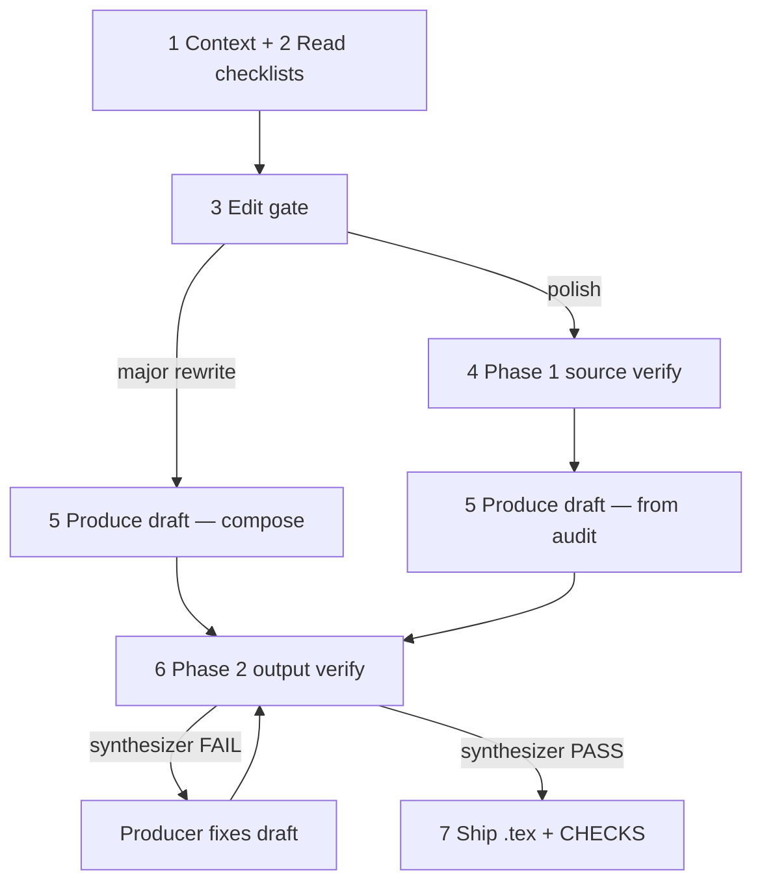

# Physics Paper Editing

Expert scientific editor for physics and mathematics at graduate level.

## Purpose

Edit LaTeX prose using a **two-phase verification pipeline**:

1. **Phase 1 (source verify)** — audit the user's existing prose before editing (polish path only).
2. **Phase 2 (output verify)** — independent verifier subagents grade the producer's draft before shipping.

The **producer** (main agent) writes the draft and applies fixes. It **must not** grade its own draft or set `OVERALL: PASS|FAIL` — only the Phase 2 **verifier synthesizer** may do that.

---

## Unit of work

This skill edits **one passage at a time**, at most **12 sentences** (see sentence-count thresholds below). Passages longer than that are out of scope — ask the user to narrow the selection or use a future section-level skill.

**Input:** one passage ≤12 sentences, plus optional short context (neighbors, section title, brief).

**Output (Agent mode):** synthesizer `OVERALL: PASS`, the `.tex` file updated, and the verbatim `<!-- CHECKS ... -->` block in the response.

**Output (Ask mode):** same CHECKS block and edited LaTeX preview; no `.tex` write until Agent mode.

A caller (e.g. a future macro skill) may invoke this skill repeatedly on successive ≤12-sentence units; each invocation is an independent unit of work with its own draft scope and verifier model profile.

---

## Roles and terms

| Term | Meaning |
|------|---------|
| **Producer** | Main agent — steps 1–5 and 7; applies fixes when Phase 2 FAILs |
| **Sentence verifier** | Task subagent — one sentence (or batched pair); 13 objectives ([sentence-check-subagents.md](sentence-check-subagents.md)) |
| **Narrative verifier** | Task subagent — full passage; four narrative groups ([narrative-checks.md](narrative-checks.md)) |
| **Math verifier** | Task subagent — full passage when math or logical argument present ([math-checks.md](math-checks.md)) |
| **Verifier synthesizer** | Task subagent — merges verifier reports; **sole** `OVERALL` authority ([phase2-verify-subagents.md](phase2-verify-subagents.md)) |
| **Edit gate** | Step 3 — compose vs polish + whether Phase 1 runs ([gate.md](gate.md)) |
| **Source verify gate** | Step 4 — INLINE vs SUBAGENTS for Phase 1 ([gate.md](gate.md)) |
| **INLINE** | Main agent runs sentence checks directly (no sentence Tasks) |
| **SUBAGENTS** | Task subagents run sentence checks ([sentence-check-subagents.md](sentence-check-subagents.md)) |
| **Changed sentences** | Phase 2: labels **S*k*** whose text differs from the prior baseline ([phase2-verify-subagents.md](phase2-verify-subagents.md)) |
| **CHECKS block** | HTML comment with per-check results and `OVERALL: PASS\|FAIL` — Phase 2 only; synthesizer is sole authority |

**Sentence-count thresholds** (Phase 1 gates only — canonical):

| Count | Effect |
|-------|--------|
| **1** (or fragment) | Always **INLINE** |
| **2–10** | Feasible for **SUBAGENTS** — one Task per sentence |
| **11–12** | Feasible; may batch 2 sentences per Task |
| **>12** | **Not feasible** — **ASK USER** unless user narrows scope |

### Agent tiers

Decompose by **which agent runs**, not abstract job titles. One worker subagent = one specialist.

| Tier | Who | Writes prose? | Dispatches Tasks? | Grades `OVERALL`? |
|------|-----|---------------|-------------------|-------------------|
| **Main agent** (Producer) | 1 agent | Yes (draft + fixes) | Yes | **No** |
| **Verifier subagents** | sentence · narrative · math — one specialist each | No (sentence may suggest `Edited:`) | No | No |
| **Verifier synthesizer** | 1 agent | No | No | **Yes (sole authority)** |

**Writer ≠ grader invariant:** the agent that writes the passage-level draft (Producer) must never be the agent that sets `OVERALL: PASS|FAIL`. Phase 2 enforces this: checkers and synthesizer are readonly Tasks; only the synthesizer emits CHECKS and OVERALL.

Phase 1 sentence work may run on the main agent (INLINE) or sentence verifier Tasks (SUBAGENTS). Narrative and math checks in Phase 1 run on the main agent; in Phase 2 they are verifier Tasks alongside sentence verifiers and the synthesizer.

---

## Pipeline



| | Phase 1 — source verify | Phase 2 — output verify |
|--|-------------------------|-------------------------|
| **Step** | 4 | 6 |
| **Target** | User's existing prose | Producer's generated draft |
| **When** | Polish only; skipped on major rewrite | Every edit turn |
| **Routing** | [gate.md](gate.md) | No gate — [phase2-verify-subagents.md](phase2-verify-subagents.md) |
| **Sentence** | All sentences (INLINE or SUBAGENTS) | **Changed sentences only** |
| **Narrative verifier** | Main agent | Task on **full passage** |
| **Math verifier** | Main agent (when applicable) | Task on **full passage** (when applicable) |
| **Who decides done** | Main agent → informs step 5 | **Verifier synthesizer** |
| **CHECKS** | No | Required |

Full phase comparison: [verification-loop.md](verification-loop.md).

---

## Workflow checklist

Complete steps in order.

**Hard rules:**

- Do not write `.tex` until the synthesizer reports `OVERALL: PASS`.
- Producer must not grade its own draft or set OVERALL.
- Never skip Phase 2 because Phase 1 ran.
- When any gate yields **SUBAGENTS**, use subagents — no inline shortcut ([gate.md](gate.md)).

```
[ ] 1. Context — file, neighbors, [bracket comments] as editing instructions
[ ] 2. Read checklists — see table below
[ ] 3. Edit gate — routes steps 4–5 ([gate.md](gate.md))
[ ] 4. Phase 1 source verify — polish only; skip on major rewrite ([verification-loop.md](verification-loop.md))
[ ] 5. Produce draft — compose (major rewrite) or apply Phase 1 audit (polish)
[ ] 6. Phase 2 output verify — mandatory verifier subagents ([phase2-verify-subagents.md](phase2-verify-subagents.md))
[ ] 7. Ship — write .tex; synthesizer CHECKS block in user response
```

### Step 1 — Context

| Item | Source |
|------|--------|
| Topic and main claim | User or abstract / introduction |
| Section order | User or `main.tex` (or top-level `.tex`) |
| Files for this passage | User or paths around the selection |
| `[bracket comments]` | User inline editing instructions — strip from working copy, honor in edits |

### Step 2 — What to Read

| Condition | Read |
|-----------|------|
| Always | [sentence-checks.md](sentence-checks.md) |
| 2+ sentences | + [narrative-checks.md](narrative-checks.md) |
| Math, equations, or logical argument | + [math-checks.md](math-checks.md) |
| Steps 3–4 | + [gate.md](gate.md) |
| Phase 1 SUBAGENTS or Phase 2 | + [sentence-check-subagents.md](sentence-check-subagents.md) |
| Step 6 | + [verification-loop.md](verification-loop.md), [phase2-verify-subagents.md](phase2-verify-subagents.md) |

When length is ambiguous, load sentence + narrative. When math might appear, load math too.

### Steps 3–7 — Detail files

| Step | Detail in |
|------|-----------|
| 3 Edit gate | [gate.md](gate.md) |
| 4 Phase 1 | [verification-loop.md](verification-loop.md) |
| 5 Produce draft | Compose fresh prose (major rewrite) or apply Phase 1 audit (polish) |
| 6 Phase 2 | [phase2-verify-subagents.md](phase2-verify-subagents.md) |
| 7 Ship | Write `.tex`; include synthesizer CHECKS verbatim in user response |

### AskQuestion prompts

| When | Title | Detail |
|------|-------|--------|
| Q3 not feasible (steps 3–4) | *Sentence-level checking* | [gate.md](gate.md) |
| Phase 1 SUBAGENTS | *Sentence checker model* | [sentence-check-subagents.md](sentence-check-subagents.md) §4 — fast tier |
| Phase 2 (each iteration) | *Verifier model profile* | [phase2-verify-subagents.md](phase2-verify-subagents.md) § AskQuestion — three questions (sentence · narrative+logic · synthesizer) |

Skip model AskQuestion when the user already chose models for **this same draft scope in this chat** (reuse across FAIL→fix loops).

---

## Response format

Structure every editing response as follows.

### 1. Passage summary

- What the text does and how it flows logically.
- Where it sits in the section and relation to neighbors.
- Underlying physics and mathematics.

### 2. Check report

- **First line — `Mode:`**
  - **Phase 2:** copy **verbatim** from the verifier synthesizer.
  - **Phase 1 only:** `Mode: inline|subagents|asked-user · N sentences` (+ `· M Tasks · model` when SUBAGENTS ran).
- **Sentence / narrative / math:** Summarize verifier reports (Phase 2) or Phase 1 audit.
- Include user editing directions and `[bracket comment]` resolutions.
- **CHECKS block** — copy **verbatim** from synthesizer after Phase 2 PASS; producer must not edit OVERALL:

  ```
  <!-- CHECKS
  ...
  OVERALL: PASS|FAIL
  -->
  ```

### 3. Clarify

One focused question if guidance is ambiguous; do not ship until resolved.

### 4. Edited text

- **Agent mode:** final passing passage; `.tex` updated in step 7.
- **Ask mode:** rendered preview and LaTeX source.

---

## File index

| File | Role |
|------|------|
| [gate.md](gate.md) | Phase 1 routing — edit gate and source verify gate |
| [verification-loop.md](verification-loop.md) | Phase 1 and Phase 2 loop rules |
| [phase2-verify-subagents.md](phase2-verify-subagents.md) | Phase 2 execution — verifiers, prompts, synthesizer |
| [sentence-check-subagents.md](sentence-check-subagents.md) | Sentence Task splitting, batching, prompts |
| [sentence-checks.md](sentence-checks.md) | 13 sentence objectives |
| [narrative-checks.md](narrative-checks.md) | Passage-level narrative groups |
| [math-checks.md](math-checks.md) | Math and logic checks |

---

## Project-specific context (optional)

When the manuscript is the Ancilla Optimization / QEC error-budgeting paper:

- **Topic:** decomposing logical infidelity into error-mechanism contributions for realistic QEC devices.
- **Typical skeleton:** Introduction → Background → full QEC evolution → logical evolution graph → Markov chain → error-budget analysis → example.
- **Main sources:** `main.tex`, `Sections/*.tex` (read only what the user points to or what surrounds the edit).

For other papers, use only the generic workflow above.
